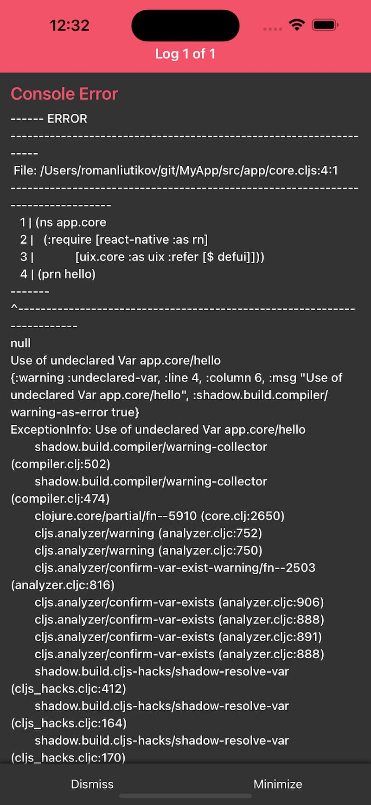
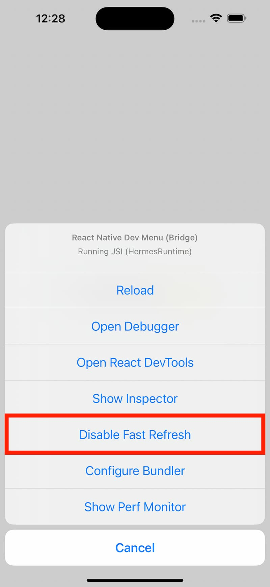

# Using React Native with UIx

1. Create RN project
```sh
npx react-native init MyApp
cd MyApp
echo 'import "./app/index.js";' > index.js
```

2. Add Clojure deps
```clojure
;; deps.edn
{:deps {org.clojure/clojure {:mvn/version "1.11.1"}
        org.clojure/clojurescript {:mvn/version "1.11.60"}
        com.pitch/uix.core {:mvn/version "0.10.0"}
        thheller/shadow-cljs {:mvn/version "2.25.8"}}
 :paths ["src" "dev"]}
```

3. Add build config
```clojure
;; shadow-cljs.edn
{:deps true
 :builds {:app
          {:target :react-native
           :init-fn app.core/start
           :output-dir "app"
           :compiler-options {:source-map-path "app/"
                              :source-map-include-sources-content true
                              :warnings-as-errors true}
           :devtools {:preloads [app.preload]
                      :build-notify app.preload/build-notify}}}}
```

4. Setup dev tooling
```clojure
;; dev/app/preload.cljs
(ns app.preload
    (:require [uix.dev]
              [clojure.string :as str]))

;; Initializes fast-refresh runtime.
(defonce __init-fast-refresh!
  (do (uix.dev/init-fast-refresh!)
      nil))

;; Called by shadow-cljs after every reload.
(defn ^:dev/after-load refresh []
  (uix.dev/refresh!))

;; Forwards cljs build errors to React Native's error view
(defn build-notify [{:keys [type report]}]
  (when (= :build-failure type)
    (js/console.error (js/Error. report))))

```

An example of forwarded cljs compiler error


5. Add some UI code
```clojure
;; src/app/core.cljs
(ns app.core
  (:require [react-native :as rn]
            [uix.core :refer [$ defui]]))

(defui root []
  ($ rn/View {:style {:flex 1
                      :align-items :center
                      :justify-content :center}} 
    ($ rn/Text {:style {:font-size 32
                        :font-weight "500"
                        :text-align :center}}
      "Hello! 👋")))

(defn start []
  (.registerComponent rn/AppRegistry "MyApp" (constantly root)))
```

6. Run the project
```sh
# start cljs build
clojure -M -m shadow.cljs.devtools.cli watch app

# start RN's Metro bundler
yarn start

# start ios (or android) simulator, or connect a real device
yarn ios
```

7. Disable RN's own Fast Refresh integration

Bring up the developer menu in the simulator (Cmd+D) and disable Fast Refresh.



## RN elements as keywords

If you prefer keyword elements in RN, you can wrap `$` macro to resolve 
keywords to RN components:

```clojure
;; src/app/uix.cljc
(ns app.uix
  #?(:cljs (:require-macros [app.uix]))
  (:require [uix.core]
            [uix.compiler.attributes :as attrs]
            #?(:cljs [react-native])))

(defn dash->camel [k]
  (let [name #?(:cljs (attrs/dash-to-camel (name k))
                :clj (name (attrs/camel-case-dom k)))]
    (str (.toUpperCase ^String (subs name 0 1)) (subs name 1))))

#?(:cljs
   (defn rn-component [cname]
     (aget react-native cname)))

#?(:clj
   (defmacro $ [tag & args]
     (if (and (keyword? tag) (not= :<> tag))
       (let [cname (dash->camel tag)]
         `(uix.core/$ (rn-component ~cname) ~@args))
       `(uix.core/$ ~tag ~@args))))
```

Now you can write UI like this:

```clojure
(ns app.core
    (:require [uix.core :refer [defui]]
              [app.uix :refer [$]]))

(defui root []
  ($ :view {:style {:flex 1
                    :align-items :center
                    :justify-content :center}} 
    ($ :text {:style {:font-size 32
                      :font-weight "500"
                      :text-align :center}}
      "Hello! 👋")))
```
