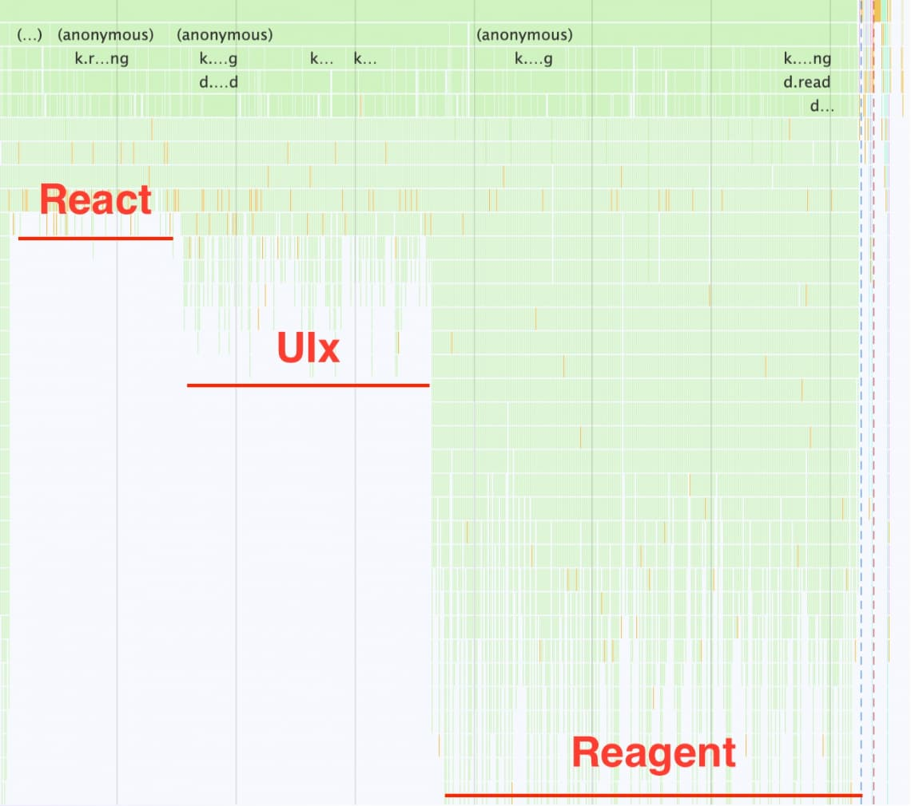
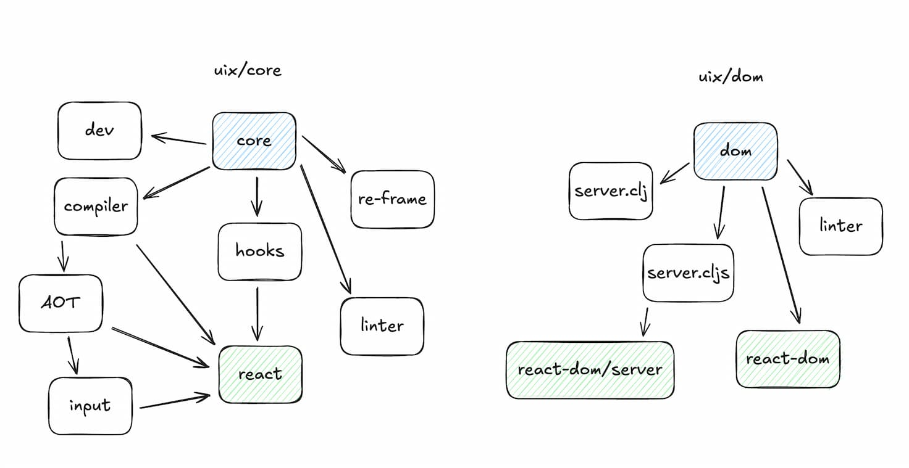

This file is a merged representation of a subset of the codebase, containing specifically included files, combined into a single document. The content has been processed where security check has been disabled.
Generated by Repomix on: 2025-02-11T11:27:16.294Z

# Files

## File: docs/chat-gpt.md

````markdown
# Getting help from ChatGPT

You can use ChatGPT to translate React/JavaScript code into UIx/ClojureScript using the following prompt:

```
You are language to language translator. Your job is to translate code from JS, React, JSX to Clojure. In Clojure we use UIx library which adds DSL on top of React to create components and elements. The library provides uix.core namespace which includes top level api, as well as react hooks.
Components are created using defui macro, here’s the syntax: (defui component-name [props-map] body)
Elements are created using $ macro: ($ :dom-element optional-props-map …children)
Component names and props are written in kebab-case. Dom element keywords support hyper script syntax to define classes and id: :div#id.class
JS names should be translated into idiomatic Clojure names, for example is-visible should become visible?
Translate the following code to Clojure
```

The prompt works quite well, here's an example:

```js
// input
function Item({ name, isPacked }) {
  return <li className="item">{name}</li>;
}

export default function PackingList() {
  return (
    <section>
      <h1>Sally Ride's Packing List</h1>
      <ul>
        <Item isPacked={true} name="Space suit" />
        <Item isPacked={true} name="Helmet with a golden leaf" />
        <Item isPacked={false} name="Photo of Tam" />
      </ul>
    </section>
  );
}
```

```clojure
;; output
(ns packing-list.core
  (:require [uix.core :refer [$ defui]]))

(defui item [{:keys [name packed?]}]
  ($ :li.item name))

(defui packing-list []
  ($ :section
     ($ :h1 "Sally Ride's Packing List")
     ($ :ul
        ($ item {:packed? true :name "Space suit"})
        ($ item {:packed? true :name "Helmet with a golden leaf"})
        ($ item {:packed? false :name "Photo of Tam"}))))
```
````

## File: docs/code-linting.md

````markdown
# Hooks linter

UIx has a built-in linter that will help you to use React Hooks correctly.
The linter is built into `defui`, `defhook` and the default `uix.core/*` hooks,
and
implements a set of rules from React's official [ESLint plugin](https://reactjs.org/docs/hooks-rules.html).

While in the original ESLint plugin there are rules that can be considered as suggestions and thus reported as warnings, most of the rules implemented in UIx should always be followed as breaking them will lead to bugs in your UI. For this reason in UIx a broken rule will fail to build so that it's impossible to build a project with problematic behaviour in UI components.

## What's the rule of thumb to use Hooks correctly?

Call hooks at the top level in the component body.

```clojure
;; bad
(defui component [{:keys [active?]}]
  (when active?
    (use-effect ...))
  ...))

;; good
(defui component [{:keys [active?]}]
  (use-effect
    (fn []
      (when active?
        ...)))
  ...))
```

List all necessary dependencies in deps vector for hooks that require dependencies.

```clojure
;; bad
(defui component [{:keys [active? id]}]
  (use-effect
    (fn []
      (when active?
        (rf/dispatch :user/set-id {:id id})))
    [active?])
  ...))

;; good
(defui component [{:keys [active? id]}]
  (use-effect
    (fn []
      (when active?
        (rf/dispatch :user/set-id {:id id})))
    [active? id])
  ...))
```

## What type of errors can UIx catch?

### Hooks called inside of conditions or iterating functions

The rule here is to call the function at the top level of the component body.

```clojure
(defui component [{:keys [active?]}]
  (when active?
    (use-effect ...)) ;; error
  ...))

(defui component [{:keys [items]}]
  (for [item items]
    ($ list-item
      {:item item
                 ;; error
       :on-click (use-callback #(rf/dispatch %) [item])}))))
```

### A hook doesn't meet its dependencies requirements

> This rule is currently experimental, to opt-out add `^:lint/disable` meta in front of the deps vector

This rule will check for missing and unnecessary dependencies and suggest a correct deps vector.

```clojure
(defui component [{:keys [active? id]}]
  (use-effect
    (fn []
      (when active?
        (rf/dispatch :user/set-id {:id id})))
    [active?]) ;; error, update deps vector to [active? id]
  ...))
```

### Unsafe set-state in effect hook without dependencies

This type of code leads to an infinite loop of updates in components.

```clojure
(defui component [{:keys [active? id]}]
  (let [[value set-value] (use-state 0)]
    (use-effect
      (fn []
        (set-value (inc value)))))) ;; error

(defui component [{:keys [active? id]}]
  (let [[value set-value] (use-state 0)]
    (use-effect
      (fn []
        (set-value (inc value)))
      [value]))) ;; fix: only run hook when value changes
```

### A hook is being passed something as deps that is not a vector literal

Deps should be always a vector literal of constant size. React doesn't allow deps to be of dynamic length because it causes issues in UI components.

```clojure
;; incorrect
(defui component [{:keys [labels]}]
  (let [dimensions (use-memo #(measure-labels labels) labels)]
    ...))

;; correct
(defui component [{:keys [labels]}]
  (let [dimensions (use-memo #(measure-labels labels) [labels])]
    ...))
```

### A hook is being passed deps as a JS array instead of a vector

This is UIx specific. Since UIx is a Clojure wrapper it expects a vector of deps instead of JS array to be more idiomatic and allow for easier interop with Clojure code.

```clojure
(defui component [{:keys [html]}]
  (let [html (use-memo #(sanitize-html html) #js [html])] ;; incorrect
    ...))

(defui component [{:keys [html]}]
  (let [html (use-memo #(sanitize-html html) [html])] ;; correct
    ...))
```

### A function reference is passed into a hook instead of an inline function

This won't cause actual bugs, but it prevents further type checking to determine if the hook satisfies dependency requirements, thus it's encouraged to use inline function instead. Note that the linter might improve in the future and this rule will be deprecated.

```clojure
(defui component [{:keys [active? id]}]
  (let [do-something (fn []
                       (when active?
                         (rf/dispatch :user/set-id {:id id})))]
    ;; deps are correct, but it still gonna error
    (use-effect do-something [active? id])))

(defui component [{:keys [active? id]}]
  (let [do-something (fn [active? id]
                       (when active?
                         (rf/dispatch :user/set-id {:id id})))]
  ;; now linter is able to check whether the effect meets deps requirements correctly
  (use-effect #(do-something active? id) [active? id])))
```

# Missing `:key` attribute

UIx will check for missing `:key` attribute when a UIx element is rendered as a list item (via `for`, `map`, etc.).

```clojure
(for [x items]
  ($ item {:title "hello" :x x})) ;; error: missing key

(for [x items]
  ($ item {:title "hello" :x x :key x})) ;; no error
```

# DOM attributes

When possible, UIx will verify DOM attributes at compile time.

```clojure
($ :div {:autoplay true})
;; WARNING: Invalid DOM property :autoplay. Did you mean :auto-play?
```

## Config

UIx's linter can be provided with an external configuration that should live in the file `.uix/config.edn` at the root of your project.

```clojure
{:linters {:react-key {:enabled? false}}}
;; the rule is enabled by default
```

# Reagent interop linter

When migrating from Reagent + re-frame to UIx you might want to keep using re-frame or at least stick with it for some time because migrating data management is not as simple as rewriting UI components.

To make sure this transition path is smooth UIx will check for re-frame `subscribe` calls in UIx components and trigger a compilation error that will suggest the use of a `use-subscribe` hook instead. It will also point to the [“Syncing with ratoms and re-frame”](https://github.com/pitch-io/uix/blob/master/docs/interop-with-reagent.md#syncing-with-ratoms-and-re-frame) section in UIx docs.

Given this piece of code

```clojure
(defui component []
  (rf/subscribe [:user/id]))
```

You'll get the following compilation error

```
re-frame subscription (rf/subscribe [:user/id])) is non-reactive in UIx components when called via re-frame.core/subscribe, use `use-subscribe` hook instead.

Read https://github.com/pitch-io/uix/blob/master/docs/interop-with-reagent.md#syncing-with-ratoms-and-re-frame for more context
```

## Config

It is possible to add re-frame specific rules to the linter config file (located in the file `.uix/config.edn` at the root of your project).

```clojure
{:linters
 {:re-frame
  {:resolve-as {my.app/subscribe re-frame.core/subscribe}}}}
  ;; re-frame.core/subscribe is checked by default
```

# Custom linters

UIx exposes a public API to register custom linters, so that you can have your own linting rules specific to your project. There are three types of linters in UIx:

- Component linters `uix.linter/lint-component` — those execute on entire `defui` form
- Element linters `uix.linter/lint-element` — execute per `$` form
- Hook linters `uix.linter/lint-hook-with-deps` — execute for every Hook form that takes deps (`use-effect`, `use-callback`, etc.)

See [core/dev/uix/linters.clj](/core/dev/uix/linters.clj) for a set of complete examples.

# clj-kondo

UIx has importable configuration for clj-kondo. You can important the configuration with:

```bash
clj-kondo --lint "$(clojure -Spath)" --copy-configs --skip-lint
```

There is only one custom hook, which validates the arguments passed to `uix.core/$`.
````

## File: docs/code-splitting.md

````markdown
# Code-splitting and React.lazy

Let's say you want to split out a library of UI components into a separate bundle, so that it can be shared across multiple applications that depend on the library.

```clojure
(ns app.ui.lib
  (:require [uix.core :refer [defui $]]))

(defui modal [{:keys [on-close children]}]
  ...)
```

Similarly to React, with UIx you can use `uix.core/lazy` that will take care of loading the UIx component from a separate module. Then in UI code you can use React's `Suspense` to load the component lazily and display a fallback UI while it's loading. The example below demonstrates how to create and load a lazy component using the loader API from [shadow-cljs](https://github.com/thheller/shadow-cljs).

```clojure
(ns app.core
  (:require [uix.core :refer [defui $]]
            [shadow.lazy]))

;; create shadow's loadable object that references `app.ui.lib/modal` component
(def loadable-modal (shadow.lazy/loadable app.ui.lib/modal))

;; create React's lazy component that loads the modal using shadow's API
(def modal (uix.core/lazy #(shadow.lazy/load loadable-modal)))

(defui app []
  (let [[show-modal? set-show-modal!] (uix.core/use-state false)]
    ($ :div
      ($ :button {:on-click #(set-show-modal! true)})
      ;; wrap the "lazy" `modal` with React's `Suspense` component and provide a fallback UI
      ($ uix.core/suspense {:fallback ($ :div "Loading...")}
        (when show-modal?
          ;; when rendered, React will load the module while displaying the fallback
          ;; and then render the component referenced from the module
          ($ modal {:on-close #(set-show-modal! false)}))))))
```

For the above to compile correctly you'd have to update build config in `shadow-cljs.edn`:

```clojure
{:module-loader true
 :modules {:main {:entries [app.core}}
           :ui-lib {:entries [app.ui.lib}
                    :depends-on #{:main}}}

```

If you are not familiar with ClojureScript's `:modules` configuration, make sure to read [documentation about this compiler option](https://clojurescript.org/reference/compiler-options#modules).

Also check out [React's documentation page on Code-splitting and React.lazy](https://reactjs.org/docs/code-splitting.html) for more examples.

## When not using react-refresh

If you are using shadow-cljs and doing traditional hot-reloading aka re-render from the root, then the above setup is not going to work. However it can be easily fixed. The only change required is to provide shadow's `loadable` as the second argument to `uix.core/lazy`.

```clojure
(def modal (uix.core/lazy #(shadow.lazy/load loadable-modal)
                          loadable-modal))
```
````

## File: docs/components.md

````markdown
# Components

UIx components are defined using the `defui` macro, which returns React elements created using the `$` macro. The signature of `$` macro is similar to `React.createElement`, with an additional shorthand syntax in the tag name to declare CSS id and class names (similar to Hiccup):

```js
// React without JSX
React.createElement("div", { onClick: f }, child1, child2);
```

```clojure
;; UIx
($ :div#id.class {:on-click f} child1 child2)
```

```clojure
(ns my.app
  (:require [uix.core :refer [defui $]]))

(defui button [{:keys [on-click children]}]
  ($ :button {:on-click on-click}
    children))

(defui text-input [{:keys [value type on-change]}]
  ($ :input {:value value
             :type type
             :on-change #(on-change (.. % -target -value))}))

(defui sign-in-form [{:keys [email password]}]
  ($ :form
    ($ text-input {:value email :type :email})
    ($ text-input {:value password :type password})
    ($ button {} "Sign in")))
```

## Inline components

Sometimes you might want to create an inline component using anonymous function. Let's take a look at the following example:

```clojure
(defui ui-list [{{:keys [key-fn data item]}}]
  ($ :div
    (for [x data]
      ($ item {:data x :key (key-fn x)}))))

(defui list-item [{:keys [data]}]
  ($ :div (:id data)))

($ ul-list
  {:key-fn :id
   :data [{:id 1} {:id 2} {:id 3}]
   :item list-item})
```

In the example above `ul-list` takes `item` props which has to be a `defui` component, which means you have to declare `list-item` elsewhere.

With `uix.core/fn` it becomes less annoying:

```clojure
(defui ui-list [{{:keys [key-fn data item]}}]
  ($ :div
    (for [x data]
      ($ item {:data x :key (key-fn x)}))))

($ ul-list
  {:key-fn :id
   :data [{:id 1} {:id 2} {:id 3}]
   :item (uix/fn [{:keys [data]}]
           ($ :div (:id data)))})
```

## Component props

`defui` components are similar to React’s JSX components. They take props and children and provide them within a component as a single map of props.

Let's take a look at the following example:

```js
function Button({ onClick, children }) {
  return <button onClick={onClick}>{children}</button>;
}

<Button onClick={console.log}>Press me</Button>;
```

The `Button` component takes JSX attributes and the `"Press me"` string as a child element. The signature of the component declares a single parameter which is assigned to an object of passed in attributes + child elements stored under the `children` key.

Similarly in UIx, components take a map of props and an arbitrary number of child element. The signature of `defui` declares a single parameter which is assigned a hash map of passed in properties + child elements stored under the `:children` key.

```clojure
(defui button [{:keys [on-click children]}]
  ($ :button {:on-click on-click}
    children))

($ button {:on-click js/console.log} "Press me")
```

## Performance optimisation

To avoid unnecessary updates, UIx components can be memoised using `uix.core/memo` function or `^:memo` tag.

```clojure
(defui ^:memo child [props] ...)

(defui parent []
  ($ child {:x 1}))
```

As long as `props` doesn't change when `parent` is updated, the `child` component won't rerun. Read [React docs on memoisation](https://react.dev/reference/react/memo) to learn when to use this optimisation.

## DOM attributes

DOM attributes are written as keywords in kebab-case. Values that are normally strings without whitespace can be written as keywords as well, which may improve autocompletion in your IDE.

```clojure
($ :button {:title "play button"
            :data-test-id :play-button})
```

## children

Similar to React, child components are passed as `children` in the props map. `children` is a JS Array of React elements.

```clojure
(defui popover [{:keys [children]}]
  ($ :div.popover children))
```

## :ref attribute

[Refs](https://reactjs.org/docs/refs-and-the-dom.html) provide a way to refer to DOM nodes. In UIx `ref` is passed as a normal attribute onto DOM elements, similar to React. `use-ref` returns a ref with an Atom-like API: the ref can be dereferenced using `@` and updated with either `clojure.core/reset!` or `clojure.core/swap!`.

```clojure
(defui form []
  (let [ref (uix.core/use-ref)]
    ($ :form
      ($ :input {:ref ref})
      ($ :button {:on-click #(.focus @ref)}
        "press to focus on input"))))
```

> UIx components don't take refs because they are built on top of React's function-based components which don't have instances.

When you need to pass a ref into child component, pass it as a normal prop.

```clojure
(defui text-input [{:keys [ref]}]
  ($ :input {:ref ref}))

(defui form []
  (let [ref (uix.core/use-ref)]
    ($ :form
      ($ text-input {:ref ref})
      ($ :button {:on-click #(.focus @ref)}
        "press to focus on input"))))
```

## Class-based components

Sometimes you want to create a class-based React component, for example an error boundary. For that there's the `uix.core/create-class` function.

```clojure
(def error-boundary
  (uix.core/create-class
    {:displayName "error-boundary"
     :getInitialState (fn [] #js {:error nil})
     :getDerivedStateFromError (fn [error] #js {:error error})
     :componentDidCatch (fn [error error-info]
                          (this-as this
                            (let [props (.. this -props -argv)]
                              (when-let [on-error (:on-error props)]
                                (on-error error)))))
     :render (fn []
               (this-as this
                 (if (.. this -state -error)
                   ($ :div "error")
                   (.. this -props -children))))}))

($ error-boundary {:on-error js/console.error}
  ($ some-ui-that-can-error))
```

## Props transferring via spread syntax

One thing that is sometimes useful in React/JavaScript, but doesn't exist in Clojure, is object spread syntax for Clojure maps (see [object spread in JS](https://developer.mozilla.org/en-US/docs/Web/JavaScript/Reference/Operators/Spread_syntax)).
It's often used for props transferring to underlying components and merging user-defined props with props provided by third-party React components.

```javascript
function Button({ style, ...props }) {
  return (
    <div style={style}>
      <MaterialButton {...props} />
    </div>
  );
}
```

In Clojure you'd have to `merge` props manually, which is not only verbose, but also won't work with third-party React components that supply props as JS object, because in UIx props is Clojure map.

```clojure
(ns app.core
  (:require [uix.core :as uix :refer [defui $]]
            ["react-hook-form" :as rhf]))

(defui form [{:keys [input-style]}]
  (let [f (rhf/useForm)]
    ($ :form {:on-submit (.-handleSubmit f)}
      ($ :input (merge {:style input-style}
                       ;; can't merge JS object returned from .register call
                       ;; with Clojure map above
                       (.register f "first-name"))))))
```

For this specific reason UIx adds syntactic sugar in `$` macro to support props merging regardless of their type.
To spread (or splice) a map or object into props, use `:&` key. This works only at top level of the map literal: `{:width 100 :& props1}`. When spreading multiple props, use vector syntax `{:width 100 :& [props1 props2 props3]}`.

```clojure
(defui form [{:keys [input-style]}]
  (let [f (rhf/useForm)]
    ($ :form {:on-submit (.-handleSubmit f)}
      ($ :input {:style input-style :& (.register f "first-name")}))))
```

> Note that props spreading works the same way how `merge` works in Clojure or `Object.assign` in JS, it's not a "deep merge".
````

## File: docs/differences-from-reagent.md

```markdown
# Differences from Reagent

Fundamentally UIx is different from Reagent in a way how it tries to be as close to React as possible. This way switching from JavaScript to ClojureScript becomes less of a painful process. You will end up in a somewhat familiar environment where everything you know about React is still applicable.

## Functional React components by default

UIx components are compiled into functional React components (plain JS functions). It's still possible to create class-based components using `uix.core/create-class`.

## JSX-like static UI structure

Unlike in Reagent, React elements in UIx are created using `$` macro which enforces static UI structure that is easy to reason about. While Hiccup is quite flexible, it also makes it easy to write highly dynamic code that composes vector elements at runtime which makes it harder to read and maintain.

## Hooks

UIx exposes React hooks, unlike Reagent where it's common to use RAtoms as state primitives.

## Syntax

There's only one way to create a component in UIx, using `defui` hook. No form-1-2-3 components. With hooks you have all of the features that form-1-2-3 components provide.

## Speed

UIx is generally 1.6x slower than plain React, mainly due to use of Clojure's data structures when passing data between components, while Reagent is 2.7x slower due to the same reasons and additionally because of runtime interpreted Hiccup, and a gluing layer that connects React components to RAtoms. Hooks-based Reagent components are even slower.

Here's comparison for the amount of work React, UIx and Reagent are doing when running a synthetic benchmark.



## Components are not memoized by default

While it can be tempting to memoize every component because props are immutable maps, UIx does not memoize components by default. Often in React and UIx it's cheaper to re-run a component instead of comparing props map. Immutable data may still come at cost, where in the worst case data structures are fully traversed, essentially performing deep equals.

## No custom scheduling mechanism

In UIx, UI update cycle is managed by React. Reagent is however using `requestAnimationFrame` to enforce _always_ asynchronous UI updates, which leads to issues when user input should be handled synchronously and thus requires additional layer in input fields to fix this problem.

## Built-in linter

UIx has a built-in linter that works well thanks to non ambiguous and static UI structure enforced by `$` macro.

## SSR on JVM

UIx components can be rendered on JVM using serializer borrowed from Rum.

## More

Learn more about differences and migration path from [this slide deck](https://pitch.com/public/821ed924-6fe6-4ce7-9d75-a63f1ee3c61f).
```

## File: docs/effects.md

````markdown
# Effects

UIx provides a way to perform side effects in components via [React’s effect hook](https://reactjs.org/docs/hooks-effect.html). Effects are useful for making HTTP requests, interacting with the DOM, or performing any kind of impure operation that mutates some global state and might need to be cleaned up at some point in the future.

The `uix.core/use-effect` function wraps React's `useEffect` hook and takes care of handling certain inconsistencies between JS and Clojure worlds so that you don't have to. More information about effect hook is available in [React documentation on effect hook](https://reactjs.org/docs/hooks-effect.html).

In the example below, the effect's callback will execute and update the document’s title after every update of the component.

```clojure
(defui example []
  (let [[clicks set-clicks!] (uix.core/use-state 0)]
    (uix.core/use-effect
      (fn []
        (set! (.-title js/document)
              (str "Number of clicks: " clicks))))
    ($ :button {:on-click #(set-clicks! inc)}
      "increment")))
```

An optional dependencies vector allows conditional execution of an effect. In the example above, dependencies are not passed into the effect causing it to execute on every update of the component. [Read more about conditional effect execution in React docs](https://reactjs.org/docs/hooks-reference.html#conditionally-firing-an-effect).

In the example below the effect will be executed every time when a number of `clicks` becomes a multiple of 5.

```clojure
(defui example []
  (let [[clicks set-clicks!] (uix.core/use-state 0)]
    (uix.core/use-effect
      (fn []
        (set! (.-title js/document)
              (str "Number of clicks: " clicks)))
      [(zero? (mod clicks 5))])
    ($ :button {:on-click #(set-clicks! inc)}
      "increment")))
```
````

## File: docs/elements.md

````markdown
# Elements

UIx is using `$` to create elements that describe UI structure. There are 3 main types of elements: DOM elements, UIx component instances, and interop elements.

## DOM elements

`$` takes a tag name keyword, an optional map of attributes, and zero or more child elements.

```clojure
($ :button {:title "Submit"} "press me")
```

Element name is declared as a keyword with optional `id` and `class` attributes defined as a part of the name. Together they resemble CSS selector syntax.

```clojure
($ :div) ;; <div></div>
($ :h1.heading {:class "h1"} "👋") ;; <h1 class="heading h1">👋</h1>
($ :button#id.class1.class2) ;; <button id="id" class="class1 class2"></button>
```

## UIx component instances

Component instances are also created via the `$` macro call, where the first argument is the component function itself, the second argument is an optional map of props, and the rest are child elements.

```clojure
(defui button [{:keys [on-click children]}]
  ($ :button.btn {:on-click on-click}
    children))

($ button {:on-click #(js/console.log :click)}
  "press me")
```

## React component instances

React components written in JavaScript can be used directly in UIx with a minor differences in how props are passed into a component. See more detalis on the [“Interop with React”](/docs/interop-with-react.md) page.

```clojure
($ Button {:on-click #(js/console.log :click)}
  "press me")
```
````

## File: docs/hooks.md

````markdown
# Hooks

UIx wraps existing React hooks to smooth over some rough spots and provide a more idiomatic interface for Clojure. `uix.core` exposes only the default React hooks, named equivalently to the JS versions except in kebab-case, e.g. `useEffect` becomes `use-effect`.

There are multiple differences from pure React though.

## Dependency array

Some hooks accept an array of dependencies as the second argument. While in pure React this has to be an array literal, `#js []`, UIx uses a vector literal `[]` to make it more idiomatic for Clojure.

```clojure
(uix/use-effect
  (fn [] (prn x))
  [x])
```

## How are dependencies compared?

When the same dependency has a different value between component updates, the hook will rerun. But unlike in React, where dependencies are compared with `===`, which is referential equality check, in UIx hooks deps are compared with `clojure.core/=`, which means that it's safe to use immutable maps and vectors as deps values.

## Return value in effect hooks

The _setup_ function, which is passed into one of the effect hooks, requires the return value to be either a function (that will be called on _cleanup_) or `js/undefined`. Otherwise React will throw an error saying that it got something else.

```clojure
(react/useEffect
  (fn []
    :keyword) ;; returning `:keyword` here will throw
  #js [])
```

In ClojureScript, when an expression returns _nothing_, it actually returns `nil`, which is compiled into `null` in JS. Since `null` is neither a function nor `undefined` React will throw in this case as well.

```clojure
(react/useEffect
  (fn []
    (when false (prn :x))) ;; returns `nil` and thus React throws
  #js [])
```

Thus when using React hooks directly you'd have to explicitly return `js/undefined` in most cases.

```clojure
(react/useEffect
  (fn []
    (when false (prn :x))
    js/undefined)
  #js [])
```

This complication is also handled by UIx and if the return value is not a function it will automatically return `js/undefined`. However, keep in mind that since in Clojure the last expression is always returned implicitly, you still have to make sure the hook doesn't return a function accidentally, because it's going to be executed in its _cleanup_ phase.

In other words, React will never complain about the return value in UIx's effect hooks, unlike in pure React. And since Clojure has implicit return, make sure you don't return a function by accident.

```clojure
(uix/use-effect
  (fn []
    (when false (prn :x))) ;; `nil` is not a function, nothing from here
  [])

(uix/use-effect
  (fn []
    (map inc [1 2 3])) ;; return value is a collection, nothing wrong here either
  [])

(uix/use-effect
  (fn []
    (map inc)) ;; return value is a function (transducer),
  [])          ;; it's gonna be executed as a cleanup function,
             ;; is that intended?
```

## Differences from `use-callback` and `use-memo` hooks

In pure React both the `use-callback` and `use-memo` hooks accept an optional dependency array. However, since the purpose of both hooks is memoization it generally doesn't make sense to call them without any dependencies; not providing the dependency array effectively means there's no memoization applied. In JavaScript this is enforced by an ESLint rule. In UIx on we simply removed the single arity method for those hooks, and so you must always pass a dependency vector.

## `use-ref` hook

The `use-ref` hook returns an object that has a stable identity throughout the lifecycle of a component and allows storing arbitrary values inside of it. A ref is basically a mutable container bound to an instance of a component. This aligns pretty well with Clojure's `ref` types, namely `Atom` which is commonly used as a mutable container for immutable values.

While in pure React `useRef` returns an object with a `current` property, in UIx `use-ref` returns the same object but with an API identical to `Atom`. The ref can be dereferenced using `@` to read the current value, and updated via `reset!` or `swap!` to set a new value.

Note that unlike `r/atom` in Reagent, a ref in UIx and React is not a state primitive, it's a mutable value and doesn't trigger an update.

```clojure
(defui component []
  (let [ref (uix/use-ref)]
    (uix/use-layout-effect
      (fn []
        (js/console.log (.-clientWidth @ref))))
    ($ :div {:ref ref})))
```

## Creating custom hooks

While custom hooks can be defined as normal functions via `defn`, it's recommended to use `uix.core/defhook` macro when creating custom hooks.

```clojure
(defhook use-event-listener [target type handler]
  (uix/use-effect
    (fn []
      (.addEventListener target type handler)
      #(.removeEventListener target type handler))
    [target type handler]))
```

Here are some benefits of using `defhook`:

1. Enforced naming convention: hooks names must start with `use-`. The macro performs compile time check.
2. Enables hooks linting: the macro runs [built-in linter](/docs/code-linting.md) on the body of a custom hook, making sure that hooks are used correctly.
3. (Future improvement) Optional linter rule to make sure that all hooks in application code are created via `defhook`.
````

## File: docs/hot-reloading.md

````markdown
# Hot reloading

While a UIx component tree can be reloaded in a traditional way, by re-rendering from the root after reload, this resets component local state and re-runs hooks. It happens because the reloaded namespace will create new component functions, which in turn invalidate the UI tree when re-rendering after reload and cause the updated components to be re-mounted.

[react-refresh](https://www.npmjs.com/package/react-refresh) makes it possible to reload components in a way that preserves local state and the state of hooks.

## Setup for shadow-cljs

1. Make sure you have [React DevTools](https://chrome.google.com/webstore/detail/react-developer-tools/fmkadmapgofadopljbjfkapdkoienihi) installed for your browser

2. Install the package `npm install react-refresh --save-dev`

3. Add `uix.preload` to `:preloads` so that it's only loaded in dev

```clojure
;; shadow-cljs.edn
{:builds
 {:build-id
  {:devtools {:preloads [uix.preload]}}}}
```

5. That's it. Now you can edit a UIx component, hit save, and once reloaded in the browser the local state should be preserved.

### Things to look out for

Make sure that your UI is not re-rendered from the root in a traditional way when using fast-refresh, otherwise fast-refresh won't work and the state will be reset.
````

## File: docs/internals.md

```markdown
# Internals

This document describes internals of UIx to give you a better overview how the library works internally.

## High level overview

On the surface UIx is a wrapper for React.js, it consists of two packages: `uix.core` and `uix.dom`, the former wraps `react` and the latter wraps `react-dom`.



## uix/dom package

`uix.dom` namespace is a thin wrapper around `react-dom` API. `uix.dom.server` CLJS ns wraps `react-dom/server`, but CLJ ns is a custom made serializer that allows to render UIx components on JVM (of course third-party JS components won't run on JVM, so the JVM renderer is mostly useful for purely UIx made UIs or HTML templating, think static website generators). Also `uix.dom` includes a linter that validates DOM nodes.

## uix/core package

This one is a lot more involved. While the core package wraps a public API from `react`, it also makes hooks nicer, runs an internal linter and compiles components and UI structure into a more efficient code.

### `defui` and `fn` macros

`defui` is how you define a UIx component. What the macro is doing? Multiple things:

1. Handles props passing, to make sure that Clojure's data structures can be used as component props, otherwise React will destroy them when validating props object
2. Emits React component when compiling as ClojureScript and a plain function when running on JVM
3. Injects `react-refresh` setup for [hot-reloading](/docs/hot-reloading.md) in dev
4. Assigns readable component name to improve debugging (those names are printed in stack traces and in React DevTools)
5. Makes sure that a component is a single-arity function that takes a map of props
6. Runs a [linter](/docs/code-linting.md) on component's body

`uix.core/fn` macro is similar to `defui`, but should be used to create anonoymous components, which is useful for [render props technique](https://reactjs.org/docs/render-props.html).

### `$` macro

`$` is basically `React.createElement`, but with API that makes it nicer to use in Clojure world. Here's what it does:

1. Runs a linter that validates element syntax
2. Compiles DOM elements into Clojure-less code, for performance, when possible

#### Element compiler

This part, while there's not much code to it, is probably where the most of complexity in UIx lives.

`uix.compiler.aot` namespace (ahead of time compiler) takes care of compiling `$` elements to ClojureScript that is as close as possible to plain JS from performance standpoint. The compilation process boils down to transforming something like `($ :div {:on-click on-click} ...)` into `(react/createElement "div" #js {:onClick on-click} ...)`. The end goal is to have as less Clojure data types as possible in the end to achieve best performance.

The compiler is not strict and makes a set of tradeoffs to provide flexibility for developers. Thus it's allowed to have dynamic (resolved at runtime) props, although in that case props map will be interpreted at runtime.

#### Reagent's input

`uix.compiler.input` namespace provides Reagent's input DOM node wrapper to make inputs compatible with re-frame, since re-frame's update queue is always async, but in pure React, or rather browsers in general, user input should be always handled synchronously to avoid visual glitches such as lost characters or caret position.

### Hooks

UIx wraps all React's default hooks and adds an extra layer to hide differences between JS and Clojure world, to make sure that writing is a bit less annoying:

1. Compiles vector of deps into JS array
2. Runs a linter to check for invalid usages of deps
3. Handles React's requirement to return either a function or `js/undefined` from a hook in a way that `nil` becomes acceptable return value as well

### Linter

`uix.linter` implements a built-in linter that takes care of validating components and hooks. The linter is extensible via [public API](/docs/code-linting.md#custom-linters).

The linter leverages ClojureScript's analyazer to retrieve information about code structure at compile-time. This data provides info about local and global vars, usages of vars, and of course the data structure representing the code being analyzed.

When analyzing the linter collects and reports errors into ClojureScript's analyzer, that then takes care of printing those errors in terminal, failing a build and propagating them into shadow-cljs's on screen error display.

### Re-frame

`uix.re-frame` namespace provides integration of re-frame subscriptions into UIx components, via `use-subscribe` and `use-reaction` hooks.
```

## File: docs/interop-with-react.md

````markdown
# Interop with React

## Using React components in UIx

In the [“Elements”](/docs/elements.md) section it was briefly mentioned that React components written in JavaScript can be used in the `$` macro, but with a difference in how props are passed into such a component.

As an example, let's say we have `Button` component that we want to use in a UIx component.

```js
function Button({ onClick, title, style, className, children }) {
  return (
    <button onClick={onClick} title={title} style={style} className={className}>
      {children}
    </button>
  );
}
```

Here’s how to use it in UIx:

```clojure
($ Button {:on-click #(js/console.log :click)
           :title "this is a button"
           :style {:border "1px solid red"}
           :class :button}
  "press me")
```

When a non-UIx component is passed into `$`, the props map is converted into JS object using the following set of rules:

1. kebab-cased keys are automatically converted into camel-cased keys.
   - Similarly to props in a DOM element, the following keys are renamed into their React counterparts:
     - `:class` -> `"className"`
     - `:for` -> `"htmlFor"`
     - `:charset` -> `"charSet"`
1. When a component expects a kebab-cased key, it can be passed as a string to avoid conversion.
1. props map is converted _shallowly_ into a JavaScript object, meaning that nested collections and maps are not converted. If a JS component expects a prop to hold an array or an object, you have to pass it explicitly. There are two exceptions though:

   - `:style` map is always converted into a JS object because it's a common prop, when passing styles into a third-party component.
   - Keyword values are converted into strings.

## Using UIx components in React

Now the other way around, we want to use a UIx component in a React component.

To achieve this we have to write interop layer using `uix.core/as-react` helper that takes a function which will take React props as a shallow [bean](https://github.com/mfikes/cljs-bean) and call the UIx component.

> Note that `as-react` doesn’t transform camel case keys into kebab case.

```clojure
(defui button [{:keys [on-click children]}]
  ($ :button {:on-click on-click}
    children))

(def Button
  (uix.core/as-react
    (fn [{:keys [onClick children]}]
      ($ button {:on-click onClick :children children}))))
```

Now `Button` can be used as a normal React component.

```js
<Button onClick={console.log}>press me</Button>
```

### Using UIx components in render props of React components

It's not uncommon in React libraries to use [“render props” pattern](https://react.dev/reference/react/cloneElement#passing-data-with-a-render-prop) to let users of the library customize UI of the library component.

Consider this example with [React Simple Maps](https://www.react-simple-maps.io/) library. The library provides `Geographies` component that takes a function as a child element and then it's up to you to decide how to render geo data. Here's how it looks like in JS:

```js
<Geographies
  geography="/features.json"
  fill="#D6D6DA"
  stroke="#FFFFFF"
  strokeWidth={0.45}
>
  {({ geographies }) =>
    geographies.map((geo) => <Geography key={geo.rsmKey} geography={geo} />)
  }
</Geographies>
```

Note that the function takes JS object of props. We can't simply destructure the object using Clojure's `:keys` destructuring, it's meant to be used with Clojure's data structures. Because of this mismatch you have to introduce a gluing layer between JS and CLJS worlds, i.e. read data from JS object and pass it into UIx component.

To make things less cumbersome, use `cljs-bean` library to lazily convert JS data to Clojure data, either shallowly via `bean` function or recursively via `->clj` function.

```clojure
($ Geographies
   {:geography "/assets/features.json"
    :fill "#D6D6DA"
    :stroke "#FFFFFF"}
   (fn [js-props]
     (let [{:keys [geographies]} (cljs-bean.core/->clj js-props)]
       (for [geo geographies]
         ($ Geography
            {:key (:rsm-key geo)
             :geography geo})))))
```

After cleaning things a bit, the final code looks much better:

```clojure
(defui geographies [{:keys [geographies]}]
  (for [geo geographies]
    ($ Geography
      {:key (:rsm-key geo)
       :geography geo})))

($ Geographies
   {:geography "/assets/features.json"
    :fill "#D6D6DA"
    :stroke "#FFFFFF"}
   (fn [js-props]
     ($ geographies (cljs-bean.core/->clj js-props))))
```

### On `ref` forwarding

[_Not relevant for React v19 or later_](https://react.dev/reference/react/forwardRef)

Some third party React components can inject a `ref` into a child element,
which requires doing [ref forwarding](https://react.dev/reference/react/forwardRef). It's not needed when passing refs between
UIx elements, but is still required for a case when non-UIx component injects a
ref into UIx element.

For this specific case there's `uix.core/forward-ref`, which should be used exclusively in such cases. The helper takes care of merging and converting props.

> Note that `forward-ref` also doesn’t transform camel case keys into kebab case.

```clojure
(defui button [{:keys [ref children on-click onMouseDown]}]
  ;; both `ref` and `onMouseDown` were injected by `Menu`
  ...)

(def button-forwarded
  (uix/forward-ref button))

($ Menu
  ($ button-forwarded {:on-click handle-click}
    "press me))
```

## Error boundaries

Although [error boundaries](https://reactjs.org/docs/error-boundaries.html) aren't fully supported in functional React components, its still possible to use them in UIx as class-based components.

Error boundaries are SSR compatible in UIx.

```clojure
(def error-boundary
  (uix.core/create-error-boundary
   {:derive-error-state (fn [error]
                          {:error error})
    :did-catch          (fn [error info]
                          (logging/error "Component did catch" error)
                          info)}
   (fn [[state set-state!] {:keys [children]}]
     (if-some [error (:error state)]
       ($ :<>
         ($ :p.warning "There was an error rendering!")
         ($ :pre (pr-str error)))
       children))))

(defui users [{:keys [users]}]
  ($ :<>
    ($ error-boundary
      ($ user-list {:users users})
      ($ :button "Load more ..."))
    ($ :a "Back home")))
```

`derive-error-state` is used to return a value that can be read by the render function passed to `uix.core/create-error-boundary`. You can use this function to parse an exception to a more friendly format, for example. `did-catch` will be called with the exception object and any additional info. In JS the `info` will be the component stack trace. In the JVM `info` will be the name of the error boundary.
````

## File: docs/interop-with-reagent.md

````markdown
# Interop with Reagent

## Using Reagent components in UIx

In order to use a Reagent component in UIx you need to wrap Reagent's Hiccup with `r/as-element` so that Reagent can take care of Hiccup and convert it into React calls.

```clojure
(defn reagent-component []
  ...)

(defui uix-component []
  ($ :div (r/as-element [reagent-component])))
```

## Using UIx components in Reagent

When using a UIx component in Reagent (or anywhere else) you can continue to use the`$` macro without changing anything. The macro will make sure that UIx component is properly created no matter which context it is used in.

```clojure
(defui uix-component []
  ...)

(defn reagent-component []
  [:div ($ uix-component)])
```

## Syncing with ratoms and re-frame

External data sources can be consumed in hooks-based components via `useSyncExternalStoreWithSelector` from the `"use-sync-external-store"` package. This part is only concerned about making the UI components reactive on external data sources.

To sync UIx components with re-frame or Reagent's reactions use `uix.re-frame/use-subscribe` and `uix.re-frame/use-reaction` hooks respectively.

### Usage

```clojure
(ns my.app
  (:require [reagent.core :as r]
            [uix.re-frame :as urf]
            [uix.core :as uix :refer [defui $]]))

(def counter (r/atom 0))

(defui title-bar []
  (let [n (urf/use-reaction counter) ;; Reagent's reaction
        title (urf/use-subscribe [:app/title])] ;; re-frame subscription
    ($ :div
      title
      ($ :button {:on-click #(swap! counter inc)}
        n))))
```
````

## File: docs/migrating-from-reagent.md

````markdown
# Migrating from Reagent

This document describes how to migrate Reagent components to UIx, including syntactical differences and how various patterns in Reagent translate to UIx. UIx doesn't provide any abstractions on top of React, thus it is recommended to make yourself familiar with React in general. Also make sure to check out [this slide deck](https://pitch.com/public/821ed924-6fe6-4ce7-9d75-a63f1ee3c61f).

## Element syntax

`$` macro instead of vector-based Hiccup

```clojure
;; Reagent
[:div#id.class {:on-click f}
  [:div]]

;; UIx
($ :div#id.class {:on-click f}
  ($ :div))
```

## Component syntax

`uix.core/defui` macro instead of `defn`

```clojure
;; Reagent
(defn avatar [{:keys [src]}]
  [:img {:src src}])

;; UIx
(defui avatar [{:keys [src]}]
  ($ :img {:src src}))
```

## Local state

`uix.core/use-state` hook instead of `r/with-let` or a closure + `r/atom`

```clojure
;; Reagent
(defn counter [props]
  (let [state (r/atom 0)]
    (fn [props]
      [:button {:on-click #(swap! state inc)} @state])))

(defn counter [props]
  (r/with-let [state (r/atom 0)]
    [:button {:on-click #(swap! state inc)} @state]))

;; UIx
(defui counter [props]
  (let [[value set-value!] (uix/use-state 0)]
    ($ :button {:on-click #(set-value! inc)} value)))
```

## Component props

A single map of props instead of arbitrary positional arguments

```clojure
;; Reagent, positional arguments
(defn button [{:keys [on-click]} text]
  …)

[button {:on-click f} "press"]

;; UIx, a single argument of props
(defui button [{:keys [on-click text]}]
  …)

($ button {:on-click f :text "press"})
```

### Child elements in props

Child elements are always put under `:children` key in props map, instead of being positional arguments

```clojure
;; Reagent, positional arguments
(defn button [{:keys [on-click]} text]
  …)

[button {:on-click f} "press"]

;; UIx, :children key in props map
(defui button [{:keys [on-click children]}]
  …)

($ button {:on-click f} "press")
```

While arguably in Reagent a one-to-one mapping between arguments and parameters is more straightforward than having implicit `:children` key in React/Ux, the ergonomics of this approach becomes more apparent when one needs to "insert" `children` into UI tree.

```clojure
;; Reagent
(defn button [{:keys [on-click]} & children] ;; rest args
  ;; splicing into Hiccup form
  (into [:button {:on-click on-click}]
    children))

[button {:on-click f} "press" "me"]

;; UIx
(defui button [{:keys [on-click children]}] ;; :children key
  ;; passing `children` as is
  ($ :button {:on-click on-click} children))

($ button {:on-click f} "press")
```

## `key` attribute in child elements

```clojure
;; Reagent
(defn ui-list [{:keys [items]}]
  [:ul
    (for [item items]
      ^{:key (:id item)} ;; or as an attribute
      [:li (:name item)])])

;; UIx
(defui ui-list [{:keys [items]}]
  ($ :ul
    (for [item items]
      ($ :li {:key (:id item)} ;; only as attribute
        (:name item)))))
```

## Global shared state

In Reagent it's common to have shared state in the form of a global var that holds an `r/atom`. In UIx and React shared state is not global at the namespace level, instead it's a local state that lives in UI tree and is being shared down the tree via React Context.

```clojure
;; Reagent
(defonce state (r/atom 0)) ;; declare shared state

(defn child-component []
  [:button
    {:on-click #(swap! state inc)}]) ;; update the shared state

(defn parent-component []
  (let [value @state] ;; consume the shared state
    [child-component]))

;; UIx
;; declare means of sharing value in UI tree
(def state-context (uix.core/create-context []))

(defui child-component []
  ;; consume state from the context
  (let [[n set-n!] (uix/use-context state-context)]
    ($ :button {:on-click #(set-n! inc)} n)))

(defui parent-component []
  ;; declare local state to be shared in UI subtree
  (let [[n set-n!] (uix/use-state 0)]
    ;; share the state with the subtree via context
    ($ state-context {:value [n set-n!]}
      ($ child-component))))
```

## Rendering a reagent component inside a UIX component

If you need to render a reagent component inside a UIX component:

```clojure
[reagent.core :as r]

($ :div
  (r/as-element [:div "hello"]))
```
````

## File: docs/props-validation.md

````markdown
# Props validation

While in React it's common to use [`PropTypes`](https://legacy.reactjs.org/docs/typechecking-with-proptypes.html) for runtime validation or [TypeScript](https://www.typescriptlang.org/docs/handbook/jsx.html#function-component) for static type checking, in Clojure we can leverage `:pre` conditions to assert component's props at runtime.

Here's a typical example using `defn`.

```clojure
(defn user->full-name
  [{:keys [fname lname]}]
  {:pre [(string? fname) (string? lname)]}
  (str fname " " lname))

(user->full-name {:lname "Doe"})

;; Execution error (AssertionError) at user/user->full-name (form-init2978563934614804694.clj:1).
;; Assert failed: (string? fname)
```

In UIx, the syntax of the `defui` macro inherits most properties of `defn`, including pre conditions.

```clojure
(defui button
  [{:keys [children on-click]}]
  {:pre [(fn? on-click)]}
  ($ :button {:on-click on-click}
    children))
```

To improve things further and leverage `clojure.spec` for rich data validation and helpful error messages, it's recommended to use [adamrenklint/preo](https://github.com/adamrenklint/preo) library.

```clojure
(ns app.ui
  (:require [clojure.spec.alpha :as s]
            [preo.core :as p]))

(s/def :prop/on-click fn?)
(s/def ::button (s/keys :req-un [:prop/on-click]))

(defui button
  [{:keys [children on-click] :as props}]
  {:pre [(p/arg! ::button props)]}
  ($ :button {:on-click on-click}
    children))

;; trigger spec error
($ button {})


Invalid argument: props
-- Spec failed --------------------

  {}

should contain key: :on-click

| key       | spec |
|===========+======|
| :on-click | fn?  |

-- Relevant specs -------

:app.ui/button:
  (clojure.spec.alpha/keys :req-un [:prop/on-click])

-------------------------
Detected 1 error
```

> Most likely you don't want those runtime checks in production. Make sure `:elide-asserts` compiler option is set to `true`, unless if you are using `shadow-cljs`, where the option is set to `true` for `release` builds by default.

To validate React `children` you can use the following spec.

```clojure
(s/def :react/element
  (s/or
    :string string?
    :number number?
    :nil nil?
    :element react/isValidElement ;; for actual React elements
    :elements :react/elements)) ;; for nested collection of elements

;; a collection of child elements
;; can be either JS array of Clojure's sequential collection
(s/def :react/elements
  (s/coll-of :react/element :kind #(or (array? %) (sequential? %))))

;; `children` can be either a single element
;; or a collection of elements
(s/def :react/children
  (s/or :element :react/element
        :elements :react/elements))
```

## Compile-time props validation

You can also opt into props validation at compile time to further improve developer experience and make sure that no code is shipped with missing props.

To enable this feature you have to use clojure.spec (this might change in the future to allow pluggable spec libraries) and switch from `:pre` to `:props` assertion in UIx components.

```clojure
(s/def :prop/on-click fn?)
(s/def ::button (s/keys :req-un [:prop/on-click]))

(defui button
  [{:keys [children on-click] :as props}]
  {:props [::button]}
  ($ :button {:on-click on-click}
    children))
```

Given such usage of the `button` component UIx will emit compiler warning telling you that required key `:on-click` is missing from props map passed into the element.

```clojure
($ button {} "press me")
```

Why is this useful? Similar to other UIx linters, props linter enables validation during local development, in tests and on CI. Which reduces probability of shipping buggy UI.

### Limitations

Of course compile time props checking is limited by dynamic nature of the language. There are some requirements to the code that enables this linter:

- There's no validation for values in props map, only for existence of specified keys (this might change in the future, since it's possible to have partial checking for contents of props map)
- Only required keys (`:req` and `:req-un`) are checked
- The check kicks-in only for props written as map literal
````

## File: docs/react-devtools.md

```markdown
# React DevTools

[React DevTools](https://chrome.google.com/webstore/detail/react-developer-tools/fmkadmapgofadopljbjfkapdkoienihi?hl=en) is a browser extension that can be used to inspect live UI tree, component props and profile performance in DevTools.

As an alternative, there's [cljs-react-devtools](https://github.com/roman01la/cljs-react-devtools/), which is similar to React DevTools, but targets ClojureScript wrappers specifically to make sure that Clojure data structures are inspectable, as well as Reagent reactions and re-frame subscriptions.

## UIx specifics

- Jump to component definition button [2] works as expected, unlike in Reagent
- Component's props preview [3] displays JS implementation of props map instead of using Custom Formatters. The workaround for this is to use debug button [1] that will print component's data to browser console where a custom formatter ([here's how to install and enable custom formatters in Chrome](https://github.com/binaryage/cljs-devtools/blob/master/docs/installation.md#enable-custom-formatters-in-chrome)) will print props map correctly [4]


```

## File: docs/react-native.md

````markdown
# Using React Native with UIx

Follow the steps below or just run `npx create-uix-app@latest {{app-name}} --react-native` in existing React Native project. Alternatively you can create a new project using Expo `npx create-uix-app@latest {{app-name}} --expo`.

1. Create RN project

```sh
npx react-native init MyApp
cd MyApp
echo 'import "./app/index.js";' > index.js
```

2. Add Clojure deps

```clojure
;; deps.edn
{:deps {org.clojure/clojure {:mvn/version "1.11.1"}
        org.clojure/clojurescript {:mvn/version "1.11.60"}
        com.pitch/uix.core {:mvn/version "1.4.3"}
        thheller/shadow-cljs {:mvn/version "2.25.8"}}
 :paths ["src" "dev"]}
```

3. Add build config

```clojure
;; shadow-cljs.edn
{:deps true
 :builds {:app
          {:target :react-native
           :init-fn app.core/start
           :output-dir "app"
           :compiler-options {:source-map-path "app/"
                              :source-map-include-sources-content true
                              :warnings-as-errors true}
           :devtools {:preloads [app.preload]
                      :build-notify app.preload/build-notify}}}}
```

4. Setup dev tooling

```clojure
;; dev/app/preload.cljs
(ns app.preload
    (:require [uix.dev]
              [clojure.string :as str]))

;; Initializes fast-refresh runtime.
(defonce __init-fast-refresh!
  (do (uix.dev/init-fast-refresh!)
      nil))

;; Called by shadow-cljs after every reload.
(defn ^:dev/after-load refresh []
  (uix.dev/refresh!))

;; Forwards cljs build errors to React Native's error view
(defn build-notify [{:keys [type report]}]
  (when (= :build-failure type)
    (js/console.error (js/Error. report))))

```

An example of forwarded cljs compiler error


5. Add some UI code

```clojure
;; src/app/core.cljs
(ns app.core
  (:require [react-native :as rn]
            [uix.core :refer [$ defui]]))

(defui root []
  ($ rn/View {:style {:flex 1
                      :align-items :center
                      :justify-content :center}}
    ($ rn/Text {:style {:font-size 32
                        :font-weight "500"
                        :text-align :center}}
      "Hello! 👋")))

(defn start []
  (.registerComponent rn/AppRegistry "MyApp" (constantly root)))
```

6. Run the project

```sh
# start cljs build
clojure -M -m shadow.cljs.devtools.cli watch app

# start RN's Metro bundler
yarn start

# start ios (or android) simulator, or connect a real device
yarn ios
```

7. Disable RN's own Fast Refresh integration

Bring up the developer menu in the simulator (Cmd+D) and disable Fast Refresh.


## RN elements as keywords

If you prefer keyword elements in RN, you can wrap `$` macro to resolve
keywords to RN components:

```clojure
;; src/app/uix.cljc
(ns app.uix
  #?(:cljs (:require-macros [app.uix]))
  (:require [uix.core]
            [uix.compiler.attributes :as attrs]
            #?(:cljs [react-native])))

(defn dash->camel [k]
  (let [name #?(:cljs (attrs/dash-to-camel (name k))
                :clj (name (attrs/camel-case-dom k)))]
    (str (.toUpperCase ^String (subs name 0 1)) (subs name 1))))

#?(:cljs
   (defn rn-component [cname]
     (aget react-native cname)))

#?(:clj
   (defmacro $ [tag & args]
     (if (and (keyword? tag) (not= :<> tag))
       (let [cname (dash->camel tag)]
         `(uix.core/$ (rn-component ~cname) ~@args))
       `(uix.core/$ ~tag ~@args))))
```

Now you can write UI like this:

```clojure
(ns app.core
    (:require [uix.core :refer [defui]]
              [app.uix :refer [$]]))

(defui root []
  ($ :view {:style {:flex 1
                    :align-items :center
                    :justify-content :center}}
    ($ :text {:style {:font-size 32
                      :font-weight "500"
                      :text-align :center}}
      "Hello! 👋")))
```
````

## File: docs/react-three-fiber.md

```markdown
# Using React Three Fiber with UIx

Since React Three Fiber is a library that implements a custom React renderer
targeting WebGL on the web, it's really easy to set up. Just `@react-three/fiber` to your NPM
dependencies and render r3f components!

Here's an example project https://studio.learn-modern-clojurescript.com/p/default-three-fiber
```

## File: docs/server-side-rendering.md

````markdown
# Server-side rendering

- [Public API](#public-api)
- [How to write cross-platform UI code](#how-to-write-cross-platform-ui-code)
- [Hooks](#hooks)
- [Cross-platform `uix.core` API](#cross-platform-uixcore-api)

`uix.dom.server` namespace implements React's server-side rendering in Clojure enabling UIx components serialization to HTML on JVM.

```clojure
(ns my.app
  (:require [uix.core :refer [defui $]]
            [uix.dom.server :as dom.server]))

(defui title-bar []
  ($ :div.title-bar
    ($ :h1 "Hello")))

(dom.server/render-to-static-markup ($ title-bar))
;; "<div class=\"title-bar\"><h1>Hello</h1></div>"
```

## Public API

Similar to `react-dom/server` API there are two functions to render UIx components to HTML string and their streaming counterparts:

- `uix.dom.server/render-to-static-markup` and `uix.dom.server/render-to-static-stream` — generates HTML string, can be used for templating
- `uix.dom.server/render-to-string` and `uix.dom.server/render-to-stream` — generates HTML string that will be hydarated by React on the front-end, when HTML document is loaded

You can read more about these [here](https://react.dev/reference/react-dom/server).

## How to write cross-platform UI code

When UI should be rendered on JVM and hydrated on the client, that essentially means that same UI code should be able to run in both Clojure/JVM and ClojureScript/JS environments.

For that it's recommended to put shared code in `.cljc` namespaces and use [reader conditionals](https://clojure.org/guides/reader_conditionals) for platform specific code.

```clojure
;; ui.cljc
(ns app.ui
  (:require [uix.core :refer [defui $]]))

(defui title-bar []
  ($ :div.title-bar
    ($ :h1 "Hello")
    ;; js/console.log doesn't exist on JVM, thus the code
    ;; should be included only for ClojureScript
    ($ :button {:on-click #?(:cljs #(js/console.log %)
                             :clj nil)}
       "+")))

;; server.clj
(ns app.server
  (:require [uix.core :refer [$]]
            [uix.dom.server :as dom.server]
            [app.ui :as ui]))

(defn handle-request
  "Generates HTML to be sent to the client"
  []
  (dom.server/render-to-static-markup ($ ui/title-bar)))

;; client.cljs
(ns app.client
  (:require [uix.core :refer [$]]
            [uix.dom :as dom.client]
            [app.ui :as ui]))

;; Hydrates server generated HTML into dynamic React UI
(dom.client/hydrate-root (js/document.getElementById "root") ($ ui/title-bar))
```

You can find a runnable template repo [here](https://github.com/elken/uix-ssr-demo) which you can adjust yourself as needed.

This repo is setup for everything you'll need, and since it's a template repo you can easily use it to bootstrap your own SSR web apps.

## Hooks

Only a subset of Hooks runs when server rendering. Read [React docs](https://react.dev/) to understand how hooks work when server rendering.
````

## File: docs/state.md

````markdown
# State

UIx is using [React's state hook](https://reactjs.org/docs/hooks-state.html#hooks-and-function-components) for local state.

```clojure
(defui form []
  (let [[value set-value!] (uix.core/use-state "")]
    ($ :input {:value value
               :on-change #(set-value! value (.. % -target -value))})))
```

In some React wrappers state is represented using the `Atom` datatype that has has `reset!` and `swap!` operations. We take a similar naming approach and suffix state updating function with a bang `!` denoting that the operation is mutating a value.

> Similar to `clojure.core/swap!`, `set-value!` from the above example also takes a function that will receive the current value and arbitrary number of additional arguments, and return the next value of component's state.

When the initial value has to be computed before it’s used, it is recommended to pass it in a callback to `use-state`. The callback will be executed only once, in component’s initialization stage.

```clojure
(defn calculate-initial-value []
  ;; expensive computation here
  )

(uix.core/use-state calculate-initial-value)
```

## Reusable state

Because state is not directly coupled with components it is possible to build reusable behaviors on top of it. In the example below we create a `use-validation` function to encapsulate logic that keeps track of a value and applies updates when the value satisfies provided validation function.

```clojure
(defn use-validation [initial-value valid?]
  (let [[value set-value!] (uix.core/use-state initial-value)
        on-change #(let [v (.. % -target -value)]
                    (when (valid? v)
                      (set-value! v)))]
    [value on-change]))

(defui form []
  (let [[value on-change] (use-validation "" #(not (empty? %)))]
    ($ :input {:value value
               :on-change on-change})))
```
````

## File: docs/utilities.md

````markdown
# Utilities

## Component's source string

Sometimes you might need to print a component's source as a string. The most common use case would be when building a design system where it's useful to display the source alongside live UI. Instead of writing code twice (as UI code and as source string) and keeping it in sync, it is possible to print the UI code directly.

`uix.core/source` macro does exactly that, it takes a reference to a component and returns its source string at compile-time:

```clojure
(ns app.ui
  (:require [uix.core :refer [$ defui]]
            [uix.dom]))

(defui button [props]
  ($ :button.btn props))

;; renders code block with `button`s source
(uix.dom/render ($ :pre (uix.core/source button))
                (js/document.getElementById "root"))
```

## Transforming HTML and Hiccup to UIx

`uix.dev` ns exposes two functions:

- `uix.dev/from-hiccup` takes a vector of Hiccup and returns UIx element
- `uix.dev/from-html` takes a string of HTML and returns a collection of UIx elements

Some example are available [in the source](https://github.com/pitch-io/uix/blob/master/core/src/uix/dev.clj#L73-L87).
````

## File: docs/what-is-uix.md

```markdown
# What is UIx?

UIx is a ClojureScript library. It is a wrapper for React that provides an idiomatic interface into modern React.

> Because UIx is a wrapper library for React, it's highly recommended to learn more about React.js itself and make yourself comfortable with its concepts. Read [the docs](https://react.dev/) and take a [course](https://epicreact.dev/) on [React](https://www.joyofreact.com/).

## What is modern React?

A set of new APIs that also includes revamped rendering machinery. For more information on that topic read [“Introducing Concurrent Mode (Experimental)”](https://17.reactjs.org/docs/concurrent-mode-intro.html).

## How's it different from existing ClojureScript libraries?

Existing libraries came out at the time when React didn't have proper scheduling and prioritization mechanisms and components had to be declared as JavaScript classes. Most of the wrappers had to invent their own scheduling on top of React and deal with JS classes while presenting them nicely as normal ClojureScript functions with Hiccup.

Today what we call modern React includes a rendering mechanism that takes care of putting stuff on the screen efficiently and also allows declaring components directly as functions. New [APIs](https://react.dev/docs/hooks-intro.html) to help deal with side effects and state allow better modularity and reusability.

While existing code and ClojureScript wrappers can still use newer versions of React they cannot leverage all of the new features and improved rendering without introducing breaking changes or affecting performance in order to support backwards compatibility.

## Social aspect

UIx v2 is a rewrite of the [original library](https://github.com/roman01la/uix) developed by [Roman Liutikov](https://github.com/roman01la) for [Pitch](https://pitch.com/). One of the main goals of v2 was to get closer to React so that JavaScript engineers familiar with React can start using the library in no time. The motivation for this goal is driven by the fact that majority of front-end engineers switching to Clojure are coming from JavaScript background, thus we wanted to make this transition easier for them and make sure that the knowledge they already aqcuired is still applicable in UI development with ClojureScript.

## What does UIx offer?

As a ClojureScript wrapper the library offers an idiomatic interface into React while trying to be familiar to both those who have used existing wrappers and those who are coming from the JavaScript world.
```
